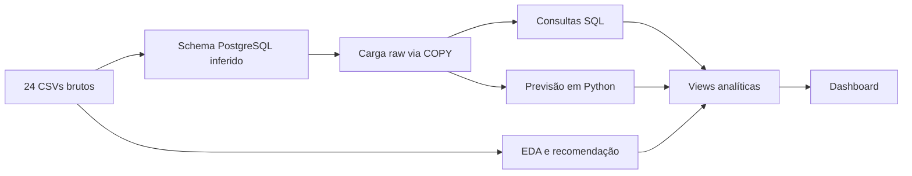

# LH Nautical — Jornada de Dados

Solução do desafio técnico da LH Nautical, cobrindo a jornada dos 24 arquivos
CSV brutos até análises em SQL, previsão de demanda, recomendação de produtos e
visualização executiva.

O projeto privilegia rastreabilidade e entregáveis independentes. Essa escolha é
intencional: cada questão pode ser avaliada e enviada separadamente, e o gerador
de schema da Questão 2 permanece autocontido e limitado à biblioteca padrão do
Python.

## Estado das entregas

| Frente | Artefato principal | Estado |
|---|---|---|
| Q1 — EDA de `orders` | [`notebooks/exploratory_analysis.ipynb`](notebooks/exploratory_analysis.ipynb) e [`sql/eda_orders.sql`](sql/eda_orders.sql) | Implementada e validada |
| Q2 — Geração do schema | [`scripts/generate_schema.py`](scripts/generate_schema.py) e [`sql/schema/schema.sql`](sql/schema/schema.sql) | Implementada |
| Q3 — Carga no PostgreSQL | [`scripts/load_data.py`](scripts/load_data.py) | Implementada; total dos CSVs validado |
| Q4 — Clientes fiéis | [`sql/loyal_customers.sql`](sql/loyal_customers.sql) | Implementada e validada nos CSVs |
| Q5 — Calendário de vendas | [`sql/sales_calendar.sql`](sql/sales_calendar.sql) | Implementada e validada nos CSVs |
| Q6 — Previsão mensal | [`scripts/forecast_baseline.py`](scripts/forecast_baseline.py) | Implementada e validada |
| Q7 — Recomendação | [`scripts/recommendation_system.py`](scripts/recommendation_system.py) | Implementada e validada |
| Dashboard | `dashboard/` | Material complementar |

As respostas prontas para a interface do desafio estão reunidas em
[`docs/respostas-e-entregaveis.md`](docs/respostas-e-entregaveis.md).

## Resultados de referência

Os valores abaixo correspondem ao snapshot atual dos CSVs em `data/raw/`:

- `orders`: 48.998 linhas, 13 colunas e valor médio de `total` de R$ 28.704,99.
- Q3: 251.864 linhas somando `customers`, `orders`, `order_items` e `payments`.
- Q4: **Hélices**, com 492 itens, é a categoria mais consumida pelos Top 10.
- Q5: **Quinta-feira** apresenta a menor média diária no canal `pos`: R$ 157.154,32.
- Q6: previsão trimestral arredondada de 98 unidades e MAE de 28 unidades.
- Q7: **Vela Mestra 1913** é o produto mais similar ao “Motor de Popa 1949”.

## Arquitetura



A descrição das camadas e da rastreabilidade está em
[`docs/arquitetura.md`](docs/arquitetura.md).

## Estrutura do repositório

```text
dashboard/          painel complementar
data/raw/           CSVs originais, sem tratamento e ignorados pelo Git
data/processed/     espaço reservado para uma futura camada tratada
docs/               arquitetura, decisões, dicionário e respostas
notebooks/          EDA e explorações adicionais
outputs/figures/    espaço reservado para figuras exportadas
scripts/            schema, carga, previsão e recomendação
sql/                EDA, análises, views e schema gerado
tests/              espaço reservado para testes automatizados
```

Os `.gitkeep` em pastas ainda vazias são intencionais: registram no Git áreas
previstas para evolução sem sugerir que elas já fazem parte do escopo entregue.

## Ambiente

- Python 3.11 ou superior; desenvolvimento validado com Python 3.14.6.
- PostgreSQL 16, disponibilizado por Docker Compose.
- Dependências Python fixadas em [`requirements.txt`](requirements.txt).
- Variáveis de conexão descritas em [`.env.example`](.env.example).

### Preparação

A partir da raiz do projeto, crie o ambiente e instale as dependências:

```shell
python -m venv .venv
```

Ative o ambiente conforme o sistema operacional:

```shell
# Linux e macOS
source .venv/bin/activate

# Windows PowerShell
.\.venv\Scripts\Activate.ps1
```

Instale as dependências, crie o `.env` a partir do exemplo e inicie o banco:

```shell
python -m pip install -r requirements.txt
```

```shell
# Linux e macOS
cp .env.example .env

# Windows PowerShell
Copy-Item .env.example .env
```

Revise os valores do `.env` antes de iniciar o PostgreSQL:

```shell
docker compose up -d
```

Se `python` não estiver registrado com esse nome, use o comando equivalente da
instalação local, como `python3` em Linux/macOS ou `py -3` no Windows.

## Execução

### 1. Gerar o schema da camada bruta

Este comando atende à restrição da Q2: o script usa apenas a biblioteca padrão.

```shell
python scripts/generate_schema.py --input data/raw --output sql/schema/schema.sql
```

### 2. Criar as tabelas e carregar todos os CSVs

```shell
python scripts/load_data.py --input data/raw --schema sql/schema/schema.sql
```

O script recria o conteúdo de cada tabela com `TRUNCATE` seguido de `COPY`, o
que evita duplicidade em reexecuções. Essa operação afeta apenas o PostgreSQL;
os CSVs de origem não são modificados.

### 3. Executar as análises SQL

O diretório `sql/` é montado como somente leitura no container. Os comandos
abaixo usam as credenciais do próprio `.env`, sem exigir `psql` instalado na
máquina nem solicitar outra senha:

```shell
docker compose exec -T nautical-postgres sh -c 'PGPASSWORD="$POSTGRES_PASSWORD" psql --no-psqlrc -v ON_ERROR_STOP=1 -h localhost -U "$POSTGRES_USER" -d "$POSTGRES_DB" -f /sql/eda_orders.sql'
docker compose exec -T nautical-postgres sh -c 'PGPASSWORD="$POSTGRES_PASSWORD" psql --no-psqlrc -v ON_ERROR_STOP=1 -h localhost -U "$POSTGRES_USER" -d "$POSTGRES_DB" -f /sql/loyal_customers.sql'
docker compose exec -T nautical-postgres sh -c 'PGPASSWORD="$POSTGRES_PASSWORD" psql --no-psqlrc -v ON_ERROR_STOP=1 -h localhost -U "$POSTGRES_USER" -d "$POSTGRES_DB" -f /sql/sales_calendar.sql'
docker compose exec -T nautical-postgres sh -c 'PGPASSWORD="$POSTGRES_PASSWORD" psql --no-psqlrc -v ON_ERROR_STOP=1 -h localhost -U "$POSTGRES_USER" -d "$POSTGRES_DB" -f /sql/vw_dashboard.sql'
```

A ordem, o grão e as regras de cada consulta estão em
[`sql/README.md`](sql/README.md).

### 4. Executar previsão e recomendação

```shell
python scripts/forecast_baseline.py --product "Bússola de Bordo 702"
python scripts/recommendation_system.py
```

O forecast lê o PostgreSQL configurado no `.env`. O recomendador lê diretamente
os CSVs, conforme permitido na Questão 7.

## Premissas e limites

As decisões de status, datas, granularidade de produto, calendário, margem e
tratamento da camada raw estão documentadas em
[`docs/decisoes-e-limitacoes.md`](docs/decisoes-e-limitacoes.md). O dicionário
das 24 fontes está em [`docs/dicionario-de-dados.md`](docs/dicionario-de-dados.md).
