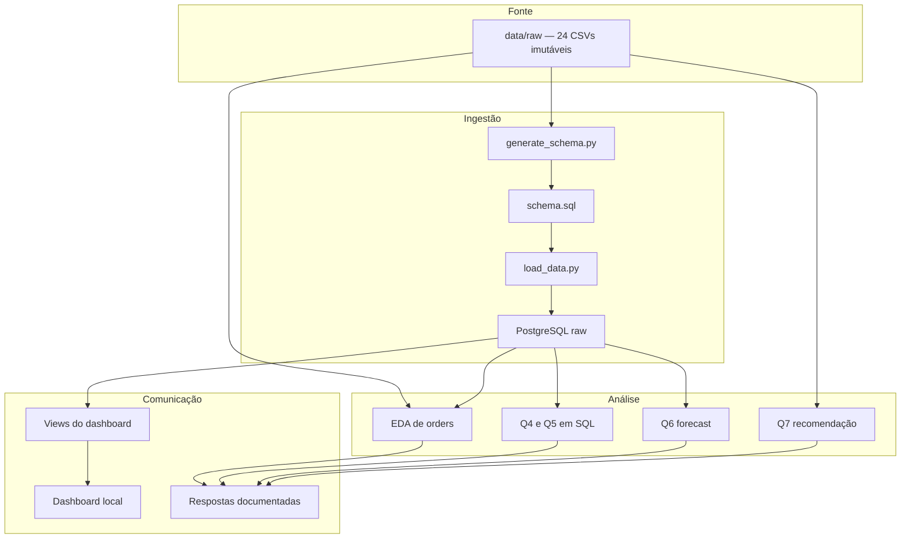

# Arquitetura e rastreabilidade

## Objetivo

A arquitetura mantém o dado bruto reproduzível e separa cada resposta do
desafio em um artefato fácil de localizar. Não há uma camada tratada genérica
nesta versão porque as questões possuem regras próprias e a entrega exige os
scripts individualmente.

## Fluxo de dados

## Camadas

### Fonte bruta

`data/raw/` contém o snapshot fornecido. Os arquivos não são alterados,
normalizados ou versionados no repositório. O README da pasta é o contrato da
camada e o dicionário registra grãos e chaves lógicas.

### Schema e carga

`generate_schema.py` percorre integralmente cada CSV, infere tipos compatíveis
com PostgreSQL e regenera `schema.sql`. O script não cria chaves ou `NOT NULL`,
pois ausência de nulo no snapshot não prova uma restrição do sistema de origem.

`load_data.py` aplica o schema e carrega os 24 arquivos via `COPY`. A carga é
idempotente no destino porque cada tabela é truncada antes de ser recarregada.

### Análise

- Q1 observa `orders` sem limpeza.
- Q4 e Q5 são consultas SQL autocontidas.
- Q6 consulta o PostgreSQL e trabalha em granularidade mensal.
- Q7 usa os CSVs e gera similaridade Produto × Produto.
- `vw_dashboard.sql` expõe grãos adequados à visualização executiva.

### Comunicação

`docs/respostas-e-entregaveis.md` concentra as respostas objetivas. O dashboard
é a camada visual, mas seu binário permanece fora do Git até a entrega final.

## Matriz de rastreabilidade

| Questão | Fonte | Regra central | Saída |
|---|---|---|---|
| Q1 | `orders.csv` | observação sem tratamento | notebook e SQL de EDA |
| Q2 | todos os CSVs | inferência integral, somente stdlib | `schema.sql` |
| Q3 | todos os CSVs | carga raw via `COPY` | 24 tabelas PostgreSQL |
| Q4 | pedidos, itens, variantes, produtos e categorias | diversidade ≥ 13; Top 10 por ticket | cliente e categoria líder |
| Q5 | `orders` | calendário completo e zero em dias sem venda | média por dia da semana |
| Q6 | pedidos, itens, variantes e produtos | média dos últimos 3 meses do treino | previsão Jan–Mar/2026 e MAE |
| Q7 | pedidos, itens, variantes e produtos | matriz binária e cosseno | Top 5 similares |

## Evolução planejada

As pastas `data/processed/`, `outputs/figures/` e `tests/` estão reservadas para
uma futura camada tratada, exportação de gráficos e testes automatizados. Elas
não são apresentadas como entregas já concluídas.

